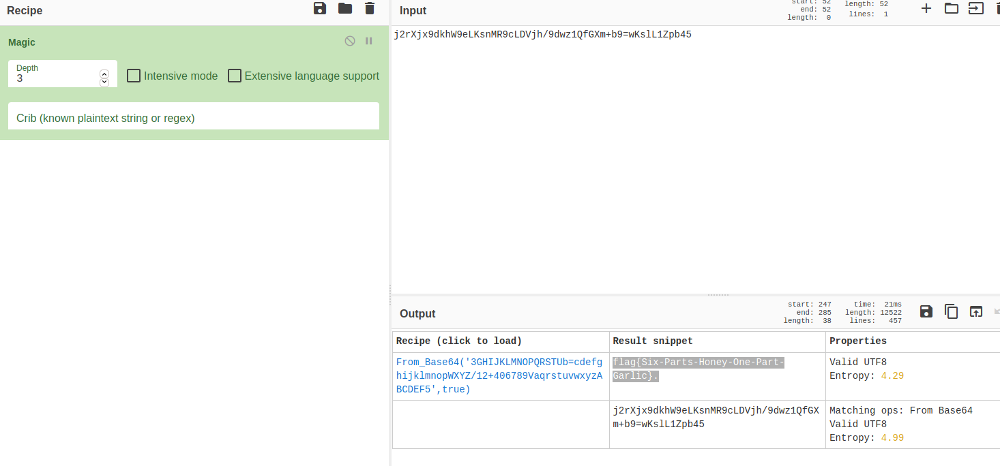

# Poor Megan | Cryptography

## Description
- - -
Oh, NO! Poor Megan! She's just been bitten by a ZOMBIE! We can save her if we act fast, but the formula for the antidote has been scrambled somehow. Figure out how to unscramble the formula to save Megan from certain zombification. Enter the answer as flag{here-is-the-answer}.

The formula for the antidote: j2rXjx9dkhW9eLKsnMR9cLDVjh/9dwz1QfGXm+b9=wKslL1Zpb45

## Solution
- - -
Take the encoded string and put it into CyberChef. Use the Magic option and it will reveal the flag.

## Flag
- - -
flag{Six-Parts-Honey-One-Part-Garlic}.