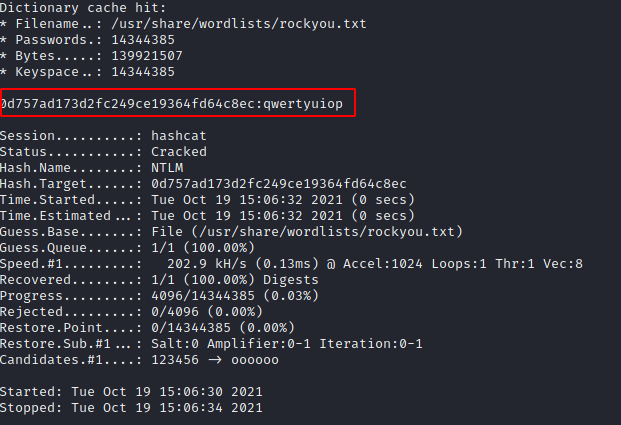

# Not So Comlicated | Exploitation

## Description
- - -

Using the memory dump file from Window Pains, crack and submit Jimmie's password. Submit the flag as flag{cleartext_password}.

## File 
- - -
The mem dump is too big for GitHib. [Link](https://tinyurl.com/wcekj3rt)

## Solution
- - -
For this challenge [Volatility3](https://www.volatilityfoundation.org/releases-vol3) was used. It is important to ensure you have all the dependencies. For this challenge I found `pycryptodome` to be especially important.

We are after Jimmie's password. Volatility3 allows us to dump hashed without needed to know memory addresses the way Volatility2 made us do. Running the following command will give us what we want:

`python3 vol.py -f physmemraw window.hashdump.Hashdump`

```
Volatility 3 Framework 1.0.0
Progress:  100.00               PDB scanning finished                     
User    rid     lmhash  nthash

Administrator   500     aad3b435b51404eeaad3b435b51404ee        31d6cfe0d16ae931b73c59d7e0c089c0
Guest   501     aad3b435b51404eeaad3b435b51404ee        31d6cfe0d16ae931b73c59d7e0c089c0
DefaultAccount  503     aad3b435b51404eeaad3b435b51404ee        31d6cfe0d16ae931b73c59d7e0c089c0
WDAGUtilityAccount      504     aad3b435b51404eeaad3b435b51404ee        0b51f04cf2a0d8f6f4469cd628a78776
Jimmie  1001    aad3b435b51404eeaad3b435b51404ee        0d757ad173d2fc249ce19364fd64c8ec
Admin   1003    aad3b435b51404eeaad3b435b51404ee        29b0d58e146d70278c29dc70f74f1e5d

```

We not have the hash for Jimmie's password. The important section to crack is the nthash section. I place this in a file called jimmie-hash

jimmie-hash
```
0d757ad173d2fc249ce19364fd64c8ec
```

Now I will use hashcat to crack it. The first thing we need to know is the hash mode to provide. So we will reference the [hashcat wiki](https://hashcat.net/wiki/doku.php?id=example_hashes) for this. We know this is an NTLM hash so we will be using hash mode 1000. We will use the rockyou password as input.



## Flag
- - -
flag{qwertyuiop}

