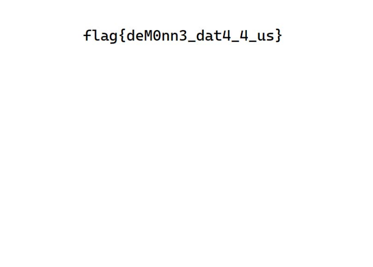

# Blood Bash 2 | Forensics

## Description
- - -
We've obtained access to a system maintained by bl0ody_mary. We believe bl0ody_mary stole a sensitive document and is storing it on her Linux machine. Search her system for any files relating to De Monne Financial.

Username: bl0ody_mary 

Password: d34df4c3

bloodbash.deadface.io:22 

## Solution:
- - -
This solution came from [Quantix](https://github.com/cftad/cftad). Thanks for the help.

We can see a pdf file in the Bl0ody_mary home directory. Attempting to SCP this file out won't work. xxd is installed on the machine. We can grab the hex for the PDF by running the following command: `xxd De\ Monne\ Customer\ Portal.pdf`.

xxd allows us to convert the hexdump back to binary format making it readable. Put the hex dump into a file and use the -r flag to convert it back.

`xxd -r dump > pdf.pdf`

We will then get the PDF with the flag:

## Flag
- - -
flag{deM0nn3_dat4_4_us}