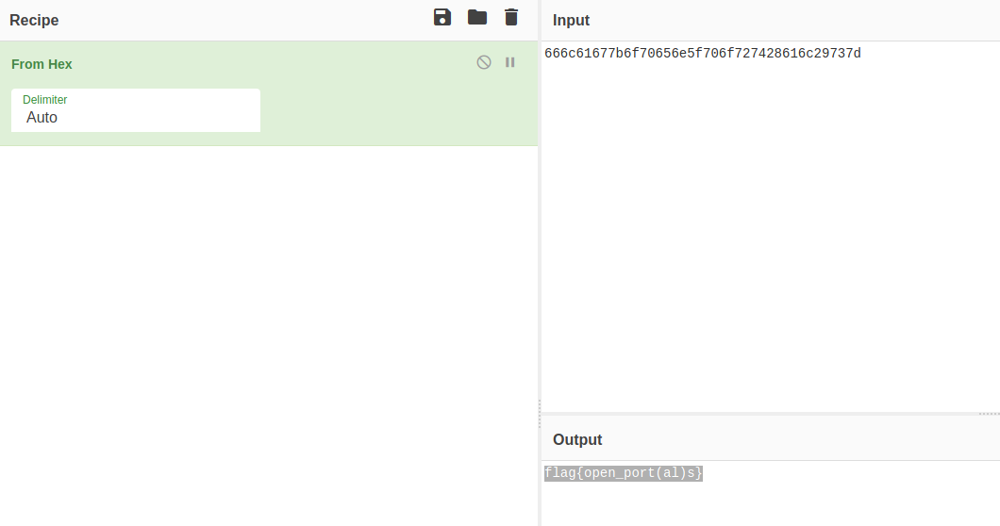

# Blood Bash 3 | Forensics

## Descritpion
There's a flag on this system that we're having difficulty with. Unlike the previous flags, we can't seem to find a file with this flag in it. Perhaps the flag isn't stored in a traditional file?

Username: bl0ody_mary

Password: d34df4c3

bloodbash.deadface.io:22 

## Solution
We know this machine is hiding the flag in an unconvential place. Root access is not necessay, however, during the CTF I captured the flag this way.

Running `sudo -l` will allow us to see where bl0ody_mary has sudo privs. 
```
Matching Defaults entries for bl0ody_mary on 40ce5b22ae81:
    env_reset, mail_badpass, secure_path=/usr/local/sbin\:/usr/local/bin\:/usr/sbin\:/usr/bin\:/sbin\:/bin\:/snap/bin

User bl0ody_mary may run the folcd lowing commands on 40ce5b22ae81:
    (ALL) NOPASSWD: /opt/start.sh, /usr/sbin/srv

```

We see a start.sh script that this user can run as sudo. Here is the content of the script:

```
#!/bin/bash

sudo /usr/sbin/srv &
exec /bin/bash

```

Running this results in the following:
```
bl0ody_mary@40ce5b22ae81:/opt$ Traceback (most recent call last):
  File "/usr/sbin/srv", line 14, in <module>
    udp_server_socket.bind((host, port))
OSError: [Errno 98] Address already in use
```

If we run it with sudo and then stop the execution of the script with ctrl+c we then land into the root user. From here we can examine the bash history of the user.

Content of .bash_history
```
...
su bl0ody_mary
exit
nano /usr/sbin/srv 
exit
...
```

We can see that someone has been editing /usr/sbin/srv with nano. Let's have a look at this. We find a Python script here.

srv:
```
#!/usr/bin/env python3

import socket as s
from binascii import hexlify as h, unhexlify as u

host = "127.0.0.1"
port = 43526
buffer = 1024

msg = b"666c61677b6f70656e5f706f727428616c29737d"
bytes_to_send = u(msg)

udp_server_socket = s.socket(s.AF_INET, s.SOCK_DGRAM)
udp_server_socket.bind((host, port))

while True:
        bytes_address_pair = udp_server_socket.recvfrom(buffer)
        #message = bytes_address_pair[0]
        address = bytes_address_pair[1]

        udp_server_socket.sendto(bytes_to_send, address)

```

There is a message variable. This looked like it could be encoded. Transfering this to CyberChef we can decode this from hex and get our flag.



## Flag
- - -
flag{open_port(al)s}