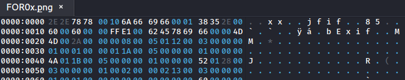

# File 101

## Description
- - -
An email, containing a photo of pumpkin, was found in an employee's Gmail inbox. The photo looks normal, but looks can be deceiving sometimes. What secrets could it be holding?

## File 
- - -
The image (2311432@.jpg) for this challenge can be found in:

ctf-writeups/DEADFACE/files/forensics


## Solution
- - -

I was able to find a download link hidden inside using the `less` command.


Going to this [link](https://www.dropbox.com/s/io1kaqznal2c10y/corrupted.zip) we get a download for a zip (corrupted.zip) with an image inside (FOR0x.png). We find out this is password protected.

We can use fcrackzip against this:

`fcrackzip -u -D -p /usr/share/wordlists/rockyou.txt corrupted.zip `

```
fcrackzip -u -D -p /usr/share/wordlists/rockyou.txt corrupted.zip 
```

The extracted image FOR0x.png is corrupted. Looking at this is a hex editor (I'm using okteta) we can see that the file header is wrong and does not match that of a png.



To resolve this a jfif image was generated and the header from it was transferred into the hex editor allowing for the image to be opened. This step was completed by [Quantix](https://github.com/cftad/cftad).


We can now open the image.


## Flag
- - -

flag{Easy_Right}


