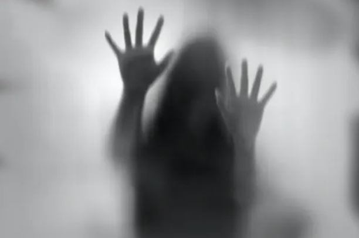
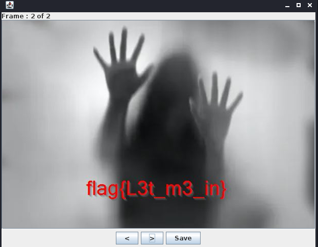

# Behind The Curtain | Steganography 

## Description 
- - -
This image was intercepted from Ghost Town. We think Donnell has hidden information here, but there doesn't seem to be anything special about the image. Can you help find the hidden information? Submit the flag as flag{this-is-the-flag}.

## File
- - -
You can find the image in this repository:

ctf-writeups/DEADFACE/files/steganography/steg01.jpg

## Solution

I tired to use steghide and stegseek to see if I could get anything but was unsuccessful. I used one of the tools found in [this repository](https://github.com/eugenekolo/sec-tools).

I navigated to stego/stegsolve and ran the install script. I then navigated to the stegsolve directory and run the tool from here. Using this tool I used the menu in the top left and used the following options: 

Analyse > Frame Browser

The new window shows there are two frames. We can navigate to the second and get our flag:

## Flag
- - -
flag{L3t_m3_in}