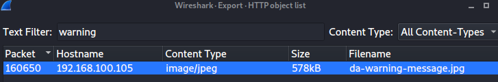

# A Warning | Traffic Analysis

## Desciption
- - -
Luciafer is being watched! Someone on the inside of Lytton Labs can see what she is doing and is sending her a message.

One of them says: "Stay away from Lytton Labs... you have been warned."

To find the flag, find the message. You'll know it when you see it. Submit the flag as flag{flag-goes-here}.

## Location of PCAP
- - -
You can find a copy of this pcap in my writeups repository. If you would like a copy, please go to:

ctf-writeups/DEADFACE/files/PCAP/pcap-challenge-final.pcapng

## Solution
- - -
We know that a warning message has been left. We can find refernces to a .txt file and a .jpg file when serching for the string "warning". Searching for the flag in the .txt file resulted in nothing. The image is being sent over HTTP so we will extract it.

Go to File > Extract Objects > HTTP. We will then find out warning message.

We can save this file and view it.

We have the warning and the flag now.

## Flag
- - -
flag{angels-fear-to-tread}