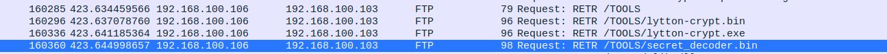
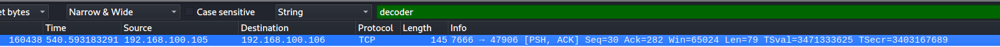
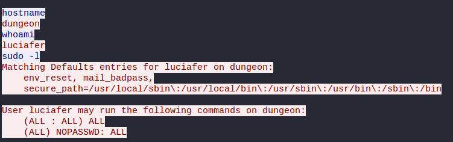
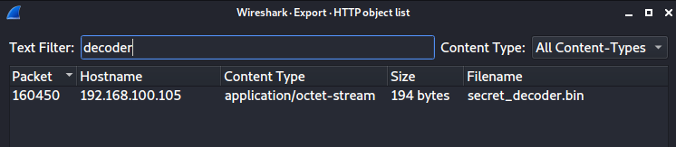

# Luciafer's Fatal Error | Traffic analysis

## Description
- - -
Luciafer, consummate hacker, got cocky and careless. She made a fatal mistake, and in doing so, gave control of her computer to... someone. She ran a program on her computer that she shouldn't have.

What is the md5sum of the program? Submit the flag as: flag{MD5}.

## Location of PCAP
- - -
You can find a copy of this pcap in my writeups repository. If you would like a copy, please go to:

ctf-writeups/DEADFACE/files/PCAP/pcap-challenge-final.pcapng


## Solution
- - -
We see references to the ip 192.168.100.106 getting files over FTP using RETR.



The one of interest here is the secret decoder. Searching for this string in the pcap we come across a wget command. 



Following the TCP Stream (right click, Follow > TCP Stream)we find the remote connection being made to luciafer (192.168.100.106) from their attacker (darkangel) (192.168.100.105). This can be seen in the whoami output.



 As wget uses HTTP we can see if this tool being used to connect to luciafer can be exported from Wireshark. Top left menu, File > Export Objects > HTTP.

 we find the file:
 

 Save this file and then we can get the MD5 hash.

 `md5sum secret_decoder.bin`
 ```
 42e419a6391ca79dc44d7dcef1efc83b  secret_decoder.bin
 ```

## Flag
- - -
flag{42e419a6391ca79dc44d7dcef1efc83b}