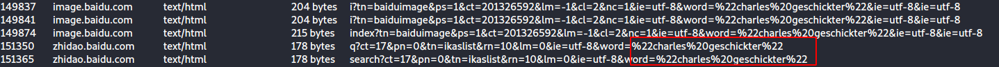

# Monstrum Ex Machina | Traffic Analysis

## Description
- - -
Our person on the "inside" of Ghost Town was able to plant a packet sniffing device on Luciafer's computer. Based on our initial analysis, we know that she was attempting to hack a computer in Lytton Labs, and we have some idea of what she was doing, but we need a more in-depth analysis. This is where YOU come in.

We need YOU to help us analyze the packet capture. Look for relevant data to the potential attempted hack.

To gather some information on the victim, investigate the victim's computer activity. The "victim" was using a search engine to look up a name. Provide the name with standard capitalization: flag{Jerry Seinfeld}.

## Location of PCAP
- - -
You can find a copy of this pcap in my writeups repository. If you would like a copy, please go to:

ctf-writeups/DEADFACE/files/PCAP/pcap-challenge-final.pcapng

## Solution
- - - 
We know that the a search engine was being used to find this name. This lets us know that we will be looking for HTTP traffic to find this. We can use wireshark to export these requests into an easy to read format.

You can access this using the menu in the top left corner. Navigate to:

File > Export Objects > HTTP

This will open a new window. In this window we can see the searches on baidu for an individual called Charles Geschickter.

## Flag
- - -
flag{Charles Geschickter}