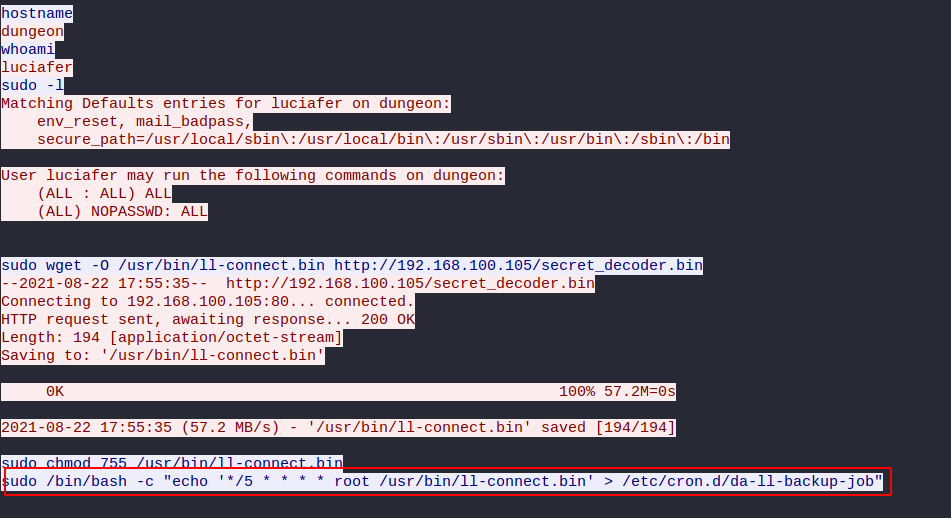

# Persistence Pays Off | Traffic Analysis

## Desciption
- - -
Luciafer might have just bit off more than she can chew! She has encountered an adversary that is counter-attacking her system!

Luciafer's Lytton Labs adversary executed a command to attain persistence on her computer. This command will allow the adversary to regain a connection to her computer again later, even if she reboots it.

What is the packet number where this command is executed. For example: flag{93721}.

## Location of PCAP
- - -
You can find a copy of this pcap in my writeups repository. If you would like a copy, please go to:

ctf-writeups/DEADFACE/files/PCAP/pcap-challenge-final.pcapng

## Solution
- - -
We shall carry on from Luciafer's Fatal Error in this challenge. In the TCP stream we can see a file ll-connect.bin getting written as a cron job. 

Searching for the string will lead us to this. We now have the packet number. 

## Flag
- - -
flag{160468}