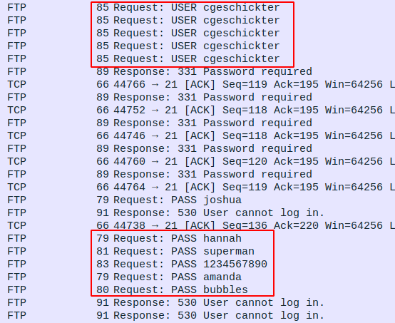
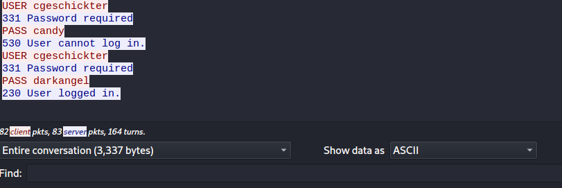

# Release The Crackin'! | Traffic Analysis

## Description
- - -
Luciafer cracked a password belonging to the victim. Submit the flag as: flag{password}.

Use the PCAP from LYTTON LABS 01 - Monstrum ex Machina.

## Location of PCAP
- - -
You can find a copy of this pcap in my writeups repository. If you would like a copy, please go to:

ctf-writeups/DEADFACE/files/PCAP/pcap-challenge-final.pcapng


## Solution
- - -
We know that the service being used to log in is going to ask for a password so we can search the file for the string "password". Applying this filter and searching through a few of the packets we see that someone is using the cgeschickter account and trying to brute force the password with rock you over FTP.



Now that we know the user is using FTP we can search for the FTP success response (230) to see the password that was successful.

Wireshark filter:
```
ftp.response.code == 230
```

Now we can right click on this and use the options Follow > TCP Stream. This will present a conversation including the failed attempts with the successful one at the end.



we now have the password that makes the flag.

## flag
- - -
flag{darkangel}