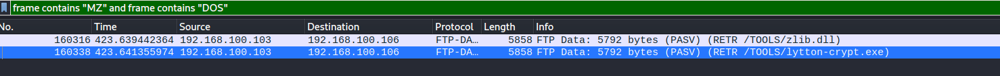
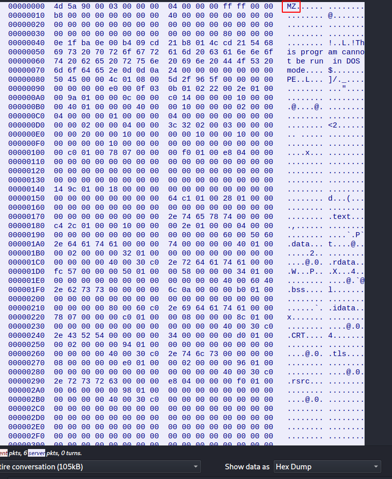
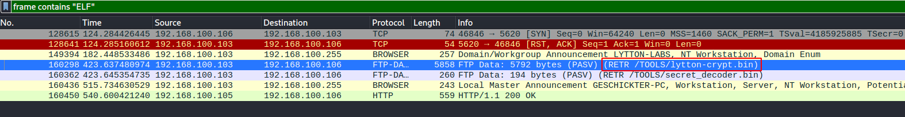
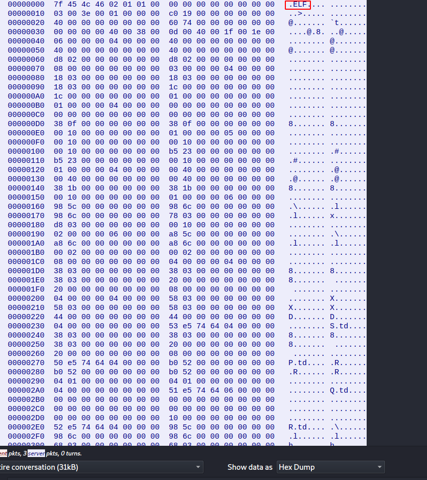

# The SUM of All FEARS | Traffic Analysis

## Description 
- - -
After hacking a victim's computer, Luciafer downloaded several files, including two binaries with identical names, but with the extensions .exe and .bin (a Windows binary and a Linux binary, respectively).

What are the MD5 hashes of the two tool programs? Submit both hashes as the flag, separated by a |: flag{ExeMD5|BinMD5}

## Location of PCAP
- - -
You can find a copy of this pcap in my writeups repository. If you would like a copy, please go to:

ctf-writeups/DEADFACE/files/PCAP/pcap-challenge-final.pcapng


## Solution
- - -

### Finding and Carving the EXE
- - -
To find the exe we can apply a filter to look for the file signatures associated with it, in this case I used:

```
frame contains "MZ" and frame contains "DOS"
```

This will return two packets. We can see that there is a tool called _lytton-crypt.exe_.



We can right click this packet and select the following options:

```
Follow > TCP Stream
```

This will open a new window with ASCII representation. We want to see the hex representation to verify this is the correct file.



From the file signature we can see this is indeed the exe file. We can now care this out. Change the data option to Raw and click the save as button in the bottom right corner.Save this file as lytton-crypt.exe.

We can now run the following command to get the MD5 hash:

`md5sum lytton-crypt.exe`
```       
9cb9b11484369b95ce35904c691a5b28  lytton-crypt.exe
```


## Finding and Carving BIN 
- - -
From the description we know this is a binary, so we can search for ELF files. Doing this we can see a packet containing lytton-crypt.bin.



We can follow the TCP Stream like before and confirm the file signature is an ELF file by looking at the hex representation.



Now we can carve the file the same way. Convert date to Raw and save the file. We can now extract the MD5 hash.

`md5sum lytton-crypt.bin`
```
4da8e81ee5b08777871e347a6b296953  lytton-crypt.bin
```

## Flag
- - -

flag{9cb9b11484369b95ce35904c691a5b28|4da8e81ee5b08777871e347a6b296953}

## Sources Used
- - -
https://shankaraman.wordpress.com/tag/how-to-extract-ftp-files-from-wireshark-packet/